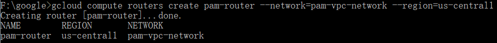

# Table of contents
Follow the steps to deploy your GAE
1. [Prerequisite](#p1)


# Part1: Prerequisite<a name="p1"></a>
## 1. Creating a project
You will need to set up a project first. 
> 1. Go to the [Manage resources page](https://console.cloud.google.com/cloud-resource-manager?walkthrough_id=resource-manager--create-project&_ga=2.219046815.768635686.1661177913-1193766713.1651689019)
> 2. On the Select organization drop-down list at the top of the page, select the organization resource in which you want to create a project. If you are a free trial user, skip this step, as this list does not appear.
> 3. Click **Create Project**.
> 4. In the **New Project** window that appears, enter a project name and select a billing account as applicable. A project name can contain only letters, numbers, single quotes, hyphens, spaces, or exclamation points, and must be between 4 and 30 characters.
> 5. Enter the parent organization or folder resource in the Location box. That resource will be the hierarchical parent of the new project. If **No organization** is an option, you can select it to create your new project as the top level of its own resource hierarchy.
> 6. When you're finished entering new project details, click **Create**.


## 2. Check if billing is enabled on a project.
Typically, projects are linked to a billing account at the time that you create the project. You can skip it if no issue is encountered with billing

>Go to the [Verify the billing status page](https://cloud.google.com/billing/docs/how-to/verify-billing-enabled) and follow the steps to check your billing status

## 3. Enable APIs
> 1. Go to [enable Cloud Build API](https://console.cloud.google.com/flows/enableapi?apiid=cloudbuild.googleapis.com&_ga=2.117968143.768635686.1661177913-1193766713.1651689019) page, make sure you select the correct project, and click on **Next**, then click on **ENABLE**.
> 2. Go to [enable Secret Manager API](https://console.cloud.google.com/flows/enableapi?apiid=secretmanager.googleapis.com&redirect=https://console.cloud.google.com&_ga=2.10889010.768635686.1661177913-1193766713.1651689019) page, click on **Next**, make sure you select the correct project, then click on **ENABLE**.

## 4. Install and initialize the gcloud CLI
> 1. Go to [Google Cloud CLI installer page](https://cloud.google.com/sdk/docs/install), download the installer that correspond to your OS, and finish the installation steps.
> 2. Open the Google Cloud SDK shell and input:\
>   ``` gcloud init ```
> 3. The terminal will automatically open a page in the browser for you to log in your google cloud account. Click on **Allow** to grant permissions to access google cloud resources.
> 4. Now you will need to select the project you just created:
> 
> 5. Initialize your App Engine app:\
> ```gcloud app create --project=[YOUR_PROJECT_ID]```
> 6. Select the region:\
> Here I select us-central(17)
> 
> 7. Run the following command to install the gcloud component that includes the App Engine extension for Python 3:\
> ```gcloud components install app-engine-python```


# Part 2: Configure Secret

## How to create secrets
> 1. Go to [gcloud console](https://console.cloud.google.com/)
> 2. Locate the search bar, and type in "**secret manager**"
> 
> 3. Click on the *Secret Manager*
> 4. In the Secret Manager API page, click on **ENABLE** to enable API.
> 
> 5. After successfully enable API, you will be redirect to the Secret Manager page.
> 
> 6. Click on **CREATE SECRET**
> 
> - 1. Under **Name**, enter your secret name
> - 2. Under **Secret value** Enter your secret value or upload a file
> 3. Click the **Create secret** button to finish.
> 4. Create secrets for 
>     - **PAM_JWT_SECRET_KEY**(JWT secret value)
>     - **PAM_DATABASE_CONNECTION** (`<URI>` of your mongoDB)
> - *if using SCRAM authentication*
>     - **PAM_MONGO_USERNAME**(`<username>`) and **PAM_MONGO_PASSWORD**(`<password>`) (if using SCRAM authentication)
> - *if using X509 certificate authentication*
>     - **PAM_X509_CERTIFICATION** (The `.pem` certificate you have downloaded from mongoDB) and **PAM_AUTH_SOURCE** (`<authSource>` from the mongoDB connection string)
> - Note: prefix of secret name should indicate the type of deployment e.g. (`QA_`: QA branch, `PROD_`: production branch) \
> It will looks like:\

## How to access the secrets in PAM app
 1. open app.yaml file in PAM and locate the **Secrets section**, locate the portion of the codes that start from **#secret section#**, it will look similar to the code down below:
```yaml
  ...
  ...
  ####secret section####
  JWT_SECRET_KEY: <JWT_SECRET_KEY>   #jwt key
  VERSION_JWT_SECRET_KEY: <Version of the VERSION_JWT_SECRET_KEY>

  DATABASE_CONNECTION: <DATABASE_CONNECTION> 
  # mongo database connection URI e.g. qa-cluster.0wnbk6p.mongodb.net
  VERSION_DATABASE_CONNECTION: <Version of DATABASE_CONNECTION>


  ## user id & password authentication  ##

  MONGO_USERNAME: <MONGO_USERNAME>   # qa mongo database username
  VERSION_MONGO_USERNAME: <Version of MONGO_USERNAME>

  MONGO_PASSWORD: <MONGO_PASSWORD>   # qa mongo database password
  VERSION_MONGO_PASSWORD: <Version of MONGO_PASSWORD>

  ## X509 certificate authentication (if blank, use userid password method, otherwise use X509) ##
  X509_CERTIFICATION: <PAM_X509>  # if wish to use password authentication, please comment out this line
  VERSION_X509_CERTIFICATION: <Version of PAM_X509>
  AUTH_SOURCE: <AUTH_SOURCE>
  VERSION_AUTH_SOURCE: <Version of AUTH_SOURCE>

  ####secret end####
  ...
  ...
 ```
 2. Change the `<variable>`and `<version of variable>`in the file to the secret name and its version which you have created in the gcloud secret manager. 
 3. Comment out any authentication method you are not using.


 ### Note:
  1. The default authentication method is **X509** (if both authentication methods info are presented in the file)
  2. If using X.509 auth method, the secret manager must have a valid x.509 certificate, AUTH_SOURCE, and their corresponding version.
  3. Each secret should have a corresponding version, the first version should be "1", you can find the version of your secrets in the secret manager console


<!-- 
# Part 3: Configure VPC for Database connection(Static outbound IP addresses)

[VPC basics](https://cloud.google.com/vpc/docs/vpc)
> ## 1. Create VPC network
> - Go to the [VPC networks page](https://console.cloud.google.com/networking/networks/list?project=project-777-346600) in the Google Cloud console.
> - Click on **create VPC network**
> - Enter a Name for the network.
> - Choose **Automatic** for Subnet creation mode 
> - click on create


> ## 2. Create a subnetwork (subnet) inside your VPC network
> - Open gcloud SDK
> - Input 
> ``` properties
> gcloud compute networks subnets create SUBNET_NAME \
>    --range=RANGE \
>    --network=NETWORK_NAME \
>    --region=REGION
> ```
>  > - SUBNET_NAME with a name you want to give to the subnet.
>  > - RANGE with the IP range you want to assign to this subnet (e.g. 10.124.0.0/28)
>  > - NETWORK_NAME with the name of your VPC network.
>  > - REGION with the region of your App Engine service.\
> It will looks like:

> ## 2. Create a Serverless VPC Access connector
> To send requests to your VPC network and receive the corresponding responses without using the public internet, you must use a Serverless VPC Access connector.
> - Ensure the Serverless VPC Access API is enabled for your project.[link](https://console.cloud.google.com/marketplace/details/google/vpcaccess.googleapis.com?project=centering-crow-362021)
> - Go to [Serverless VPC access page](https://console.cloud.google.com/networking/connectors) to create a connector
> - Click **Create connector**
> - In the Name field, enter a name for your connector.
> - In the Region field, select a region for your connector. This must match the region of your serverless service.
> - In the Network field, select the VPC network to attach your connector to.
> - Click the Subnetwork pulldown menu, and select the subnet we previously created.
> - Click on **Create**
> - screen shot


>## 3. Configure your service to use a connector
> After you have created a Serverless VPC Access connector, you must configure each service in your App Engine app that you want to connect to your VPC network.
> 1. Add the **vpc_access_connector** field to your service's **app.yaml** file
> ``` properties
> vpc_access_connector:
> name: projects/PROJECT_ID/locations/REGION/connectors/CONNECTOR_NAME
> ```
> Where **PROJECT_ID** is your Cloud project ID, **REGION** is the region your connector is in, and **CONNECTOR_NAME** is the name of your connector.\
> e.g. 
> ```properties
> projects/centering-crow-362021/locations/us-central1/connectors/pam-vpc-connector
> ```


> ## 4. Create a new Cloud Router.
> Cloud Router is a necessary control plane component for Cloud NAT.
> ```properties
> gcloud compute routers create ROUTER_NAME \
>  --network=NETWORK_NAME \
>  --region=REGION
> ```
>screen shot

> ## 4. Reserve a static IP address.
> This is the address that your service will use to send outgoing traffic. A reserved IP address resource retains the underlying IP address when the resource it is associated with is deleted and re-created. This IP address counts towards the static IP address quotas in your Google Cloud project.
> ```
> gcloud compute addresses create ORIGIN_IP_NAME \
>  --region=REGION
> ```
> > - ORIGIN_IP_NAME with the name you want to assign to the IP address resource.
> > - REGION with the region that will run the Cloud NAT router. Ideally the same region as your App Engine service to minimize latency and network costs.\
> Screen shot:

> Use the compute addresses describe command to view the result:
> ```properties
> gcloud compute addresses describe ORIGIN_IP_NAME
> ```
> ORIGIN_IP_NAME is the IP name you just assigned
> Result IP:
> 


> ## 5. Create a Cloud NAT gateway and specify your IP address.
> Traffic originating from your subnet will go through this gateway and use the static IP address that you reserved in the previous step.
> ```properties
> gcloud compute routers nats create NAT_NAME \
>   --router=pam-router \
>   --region=us-central1 \
>   --nat-custom-subnet-ip-ranges=pam-subnet \
>   --nat-external-ip-pool=pam-static-ip
>```
>> - NAT_NAME with a name for the Cloud NAT gateway resource you want to create.
>> - ROUTER_NAME with the name of your Cloud Router.
>> - REGION with the region in which you want to create a NAT gateway.
>> - ORIGIN_IP_NAME with the name of the reserved IP address resource you created in the previous step.

> screen shot 


## 6. Useful Resources
> - [IP Address](https://console.cloud.google.com/networking/addresses)

-->

# Part 3: Deployment (Single time)
## 0. prerequisite

1. Make sure you have the git Installed
2. Open app.yaml file in the PAM, and set up the PAM application running environment.
   ```yaml
    runtime: python38 #runtime environment
    service: <service_name> #Name should only be default, pam-qa, or pam (qa or production)
    env_variables:
      #configuration for the app
      API_VERSION_NUMBER: <API_version_number>  #version of current api
      SECRET_PROJECT_ID: <project_ID_for_the_secret_manager>  #SECRET_PROJECT_ID
      DATABASE_NAME: <dbname> #the mongo database name
      ...
   ```
  - `<service_name>`: [the type of service] i.e. qa, dev, production
  - `<API_version_number>`: [the version number of the deployment API, should be integer]
  - `<dbname>`: [the database you want to access, which is the same database name that is mentioned in MongoDB document]
## Note: 
- ### The first service which is deployed on GAE must be called default, which means you need to deploy the default service before deploy any other services.
## 1. Clone/Pull the repo
> open the git bash, in the terminal clone the repo to local directory(or pull the newest version):\
> ```git clone https://github.com/dataperformance/PAM.git```
## 2. Deploy
> In the same directory, run command``` gcloud app deploy```
> 

Useful information for managing the service:
> 1. You can find the [Service Page](https://console.cloud.google.com/appengine/services?_ga=2.9325619.768635686.1661177913-1193766713.1651689019) by typing in *services* in the search box in cloud console, and find App Engine service.
> 2. You can find the [App settings](https://console.cloud.google.com/appengine/settings?_ga=2.215425169.768635686.1661177913-1193766713.1651689019) by search *application settings* in cloud console and find the App engine's setting.

# Part 4: Deployment (continuous)

## 1. Create and Add the **cloud build configuration** file
> cloudbuild.yaml
```yaml
steps:
- name: "gcr.io/cloud-builders/gcloud"
  args: ["app", "deploy"]
timeout: "1600s"

options:
  logging: CLOUD_LOGGING_ONLY

```
## 2. Enable API
[Identity and Access Management (IAM) API](https://console.cloud.google.com/apis/library/iam.googleapis.com)

## 3. Fork the PAM repo to your Github account 

## 4. Build a trigger
>1. Go to [trigger page](https://console.cloud.google.com/cloud-build/triggers?_ga=2.9390899.768635686.1661177913-1193766713.1651689019)
>2. Click on **Create Trigger**
>3. Define a **Name** for the trigger
>4. Select a Region for the trigger
>5. Define an **EVENT** that invokes the trigger
>6. Select the **Repository** for the forked PAM repo
>7. put ```.*``` in the **Branch** (any branch)
>8. For the Configuration type, select **Autodetected**
>9. Leave the **service account blank**, it will use the default Cloud Build service account
>It will look like:\
>\
>
>
>9. Click on **Create**
>10. Click on **Run** to test the trigger\
>
>11. Select **Dev** branch and click on **Run trigger**
>


## 5. Monitor Build history
>1. Go to [trigger page](https://console.cloud.google.com/cloud-build/triggers?_ga=2.9390899.768635686.1661177913-1193766713.1651689019)
>2. Click on **History**
>3. You can find the build history there


# Part 5: Customer Domain
- prerequisite: own a domain


## Step 1: verify your domain
1. Click on the [**CUSTOM DOMAINS**](https://console.cloud.google.com/appengine/settings/domains) tab in the App Engine **Settings** section. 
2. Click on the **ADD A CUSTOM DOMAIN**
3. In the **Select the domain you want to use** section, choose the **Verify a new domain** option, type in the domain you want to use, and click on **VERIFY**. It will redirect you to the verification page(**Webmaster Central**).
4. In the **Webmaster Central**:
   1. Select your **domain registrar or provider**
   2. copy the TXT/CNAME record, and add the record to your DNS configuration. 
      - For example, in Hover
      - 1. locate DNS and click on **ADD A RECORD**
      - 2. Copy and paste the record from **webmaster Central**
   3. After adding the record to your domain DNS, click **VERIFY** to finish

## Step 2: Map your subdomains
1. After you finish the verification, you can go to next section **Point your domain to [projectID]**
2. You need to type in the subdomains for different deployment branches you want to map, for exmaple:
   1. QA deployment: pam-qa.< your domin >
   2. Dev deployment: pam-dev.< your domain >
3. Click on **CONTINUE** when finished

## Step 3: Update your DNS record
1. After you finish the mapping, you can go to this section.
2. Manually add all records to your domain DNS.
3. Click on finish.

## Note:
  1. You may need to wait a few hours for the custom domain to be effective.