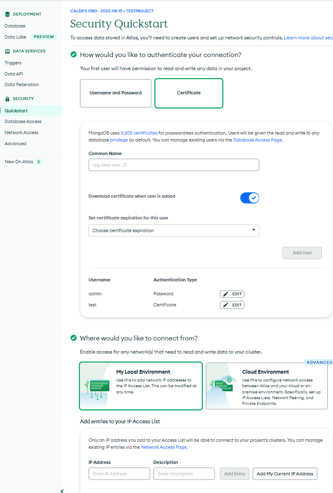

# Table of contents
1. [Part 1: Setup Mongo database](#p1)
   1. [Step 1: Sign in Mongodb account](#p11)
   2. [Step 2: Create a **Cluster**](#p12)


2. [Part 2: setup database security](#p2)
   1. [Step 1: Setup authentication security](#p21)
   2. [Step 2: Setup IP Access List.](#p22)
3. [Part 3: Connect PAM application to the database](#p3)
   1. [step 1: Get the connection string](#31)


# Part 1: setup Mongo database <a name="p1"></a>

## Step 1: sign in Mongodb account<a name="p11"></a>
1. Go to page https://www.mongodb.com/Click on the top right corner **Sign In**
3. Sign In with your account.\

note: You will need to sign up for an account before signing in, you can choose to sign up with your Google account, GitHub account or manually sign up.

## Step 2: create a new project for PAM    
1. Once you log in to your MongoDB console, you will need to set up a project for the PAM application
2. locate the top left project selection menu and click on the **+ New Project**

3. follow the instruction to name your project, add members and set permissions.
4. Click on the **Create Project** to finish.


## Step 2: create a **Cluster**<a name="p12"></a>
1. ### If no existing database in the account, click on **Build a Database**
   
2. ### Choose the deployment option, choose **Shared** for free. 
   
3. ### Select the cloud provider, Region and define cluster Name, and click on **Create Cluster** to finish
   
4. ### You will be redirected to the **Security Quickstart** page.


# Part 2: setup database security <a name="p2"></a>

## Step 1: setup authentication security<a name="p21"></a>
- Two available authentication methods **(username and password/X.509 Certificate)**
1. locate to **Quickstart** under **SECURITY** section.
2. choose the authentication you prefer. (X.509 for higher level security)
> ### Option 1: username and password
> 1. Click on **Username and Password** 
>  
> - Define your **username** and **password** for the database authentication.
> - Click on **Create User** to finish
   
> ### Option 2: X.509 Certificate
> 1. Click on **Certificate**
> 
> 
> - Define your **Common Name**, turn on the option **Download certificate when user is added** and select an expiration time for this certificate.
> - Click on **Add user** to finish and download a certificate file (X508-cert-XXX.pem). The certificate file will be used later for the GCP deployment authentication.

## Step 2: setup IP access list<a name="p22"></a>
1. scroll down and select the **My Local Environment** under **Quickstart** section page.
2. Put **0.0.0.0/0** for the **IP Address** if allow Access From All IP Addresses, and add a comment(optional) 
2. Click on **ADD Entry** to add the record.


## Click on the **Finish and Close** to finsh the security setup.

# Part 3: connect PAM application to the database <a name="p3"></a>

## step 1: get the connection string<a name="p31"></a>
1. Click on **Database** on the left\
   
2. Click on the **Connect**\
   
3. Click on **Connect with your application**\
   
4. Under **Select your drive and version**
      - Select **python** driver
      - Select **3.6 or later**

5. Choose the authentication method for your connection.
   - If you choose to use password authentication, please click on **Password(SCRAM)**.
   - If you choose to use certificate authentication, please click on **X.509**.
   - Make sure you have the corresponding authentication method set up in [Part2](#p2)
   

6. Get the connection string.
   - In this step, you need to note down the `<variable>` in the connection string that corresponds to the authentication method you wish to use for connecting the database.
   > ### For **Password(SCRAM)** authentication method:
   >  - Connection string will be in the format:
   > ```description
   > mongodb+srv://<username>:<password>@<URI>/<dbname>?retryWrites=true&w=majority
   > ```
   > 1.  `<username>` is the user name for this connection, you shuld have create one from the previous steps.
   > 2. `<password>` is the password correspond to this user.
   > 3. `<URI>` is the uinque identifier for this database, which you should get it from the connection string.
   > 4. `<dbname>` is the database name you wish to use for this connection, which in default is empty, but if you want to customize a name for the database you want to create or specify a database you want to connect, you should define it.

   > ### For **X.509** authentication method:
   >  - Connection string will be in the format:
   > ```description
   > mongodb+srv://<URI>/<dbname>?authSource=<authSource>&authMechanism=MONGODB-X509retryWrites=true&w=majority
   > ```
   > 1.  `<URI>` is the uinque identifier for this database, which you should get it from the connection string.
   > 2. `<dbname>` is the database name you wish to use for this connection, which in default is empty, but if you want to customize a name for the database you want to create or specify a database you want to connect, you should define it.
   >3. `<authSource>` is the database name associated with the user's credentials.

   Note: 


   
   
   