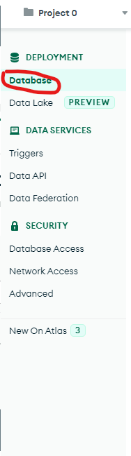

# Setup Mongo database

## Sign in Mongodb account

1. Go to page https://www.mongodb.com/
2. Click on top right corner **Sign In**
3. Sign In with your account
   

## Build a Database
1. ### If no existed database in the account, click on Build a Database
   
2. ### Choose the deployment option, here I choose the shared type
   
3. ### Select the cloud provider, Region and define cluster Name, and click on Create Cluster
   
4. ### Setup Authentication for your database connection
   
   Define your **username** and **password** for the database connection.\
   Click on Create User
5. ### Setup IP Access List.
   - Put **0.0.0.0/0** for the IP Address if allow Access From All IP Addresses or your Server IP.\
   - Enter Description for this IP.\
6. Click On Finish and Close


## Name the Database and create a Collection
1. ### Click on the Database Tag, you will find the database you just created
   
2. ### Click on the Browse Collections
   
3. ### Click on add My Own Data
   
4. ### Enter a Database name and Collection name
   \
   Here:\
   Database name: **PAM-Database**\
   Collection name: **PAM-Collection**\
   Click on **Create**
5. ### check if success
   


## Connect PAM to Database
1. Click on **Database** on the left\
   
2. Click on the **Connect**\
   
3. Click on **Connect with your application**\
   
4. Copy and Save the connection string for Python environment
   \
   Note:
   - **password** will be the password you just setup
   - **davidyin** in the string is the mongodb user name
5. ## Notes:
   1. ```mongodb+srv://davidyin:<password>@pam.nhzb5tp.mongodb.net/<dbname(optional)>?retryWrites=true&w=majority```\
      The database name is optional, here we set it to **PAM-Database**.\
      So it will looks like:\
      ```mongodb+srv://davidyin:<password>@pam.nhzb5tp.mongodb.net/PAM-Database?retryWrites=true&w=majority```


# Finish

   
   
   
   
   