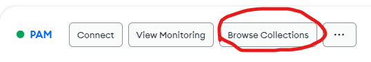
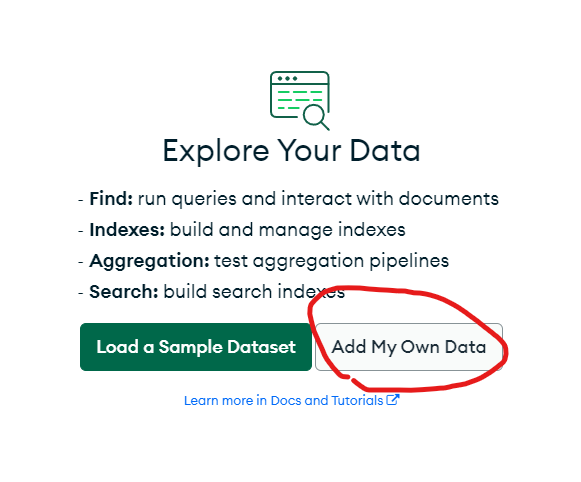

# Table of contents
1. [Part 1: setup Mongo database](#p1)
   1. [Step 1: sign in Mongodb account](#p11)
   2. [Step 2: create a **Cluster**](#p12)
   3. [Step 3: create and name a Database](#p13)


2. [Part 2: setup database security](#p2)
   1. [Step 1: setup authentication security](#p21)
   2. [Step 2: setup IP Access List.](#p22)
3. [Part 3: connect PAM application to the database](#p3)
   1. [step 1: get the connection string](#31)


# Part 1: setup Mongo database <a name="p1"></a>

## Step 1: sign in Mongodb account<a name="p11"></a>
1. Go to page https://www.mongodb.com/
2. Click on top right corner **Sign In**
3. Sign In with your account
   

## Step 2: create a **Cluster**<a name="p12"></a>
1. ### If no existing database in the account, click on **Build a Database**
   
2. ### Choose the deployment option, choose **Shared** for free. 
   
3. ### Select the cloud provider, Region and define cluster Name, and click on **Create Cluster** to finish
   


## Step 3: create and name a Database<a name="p13"></a>
1. ### Click on the **Database** Tag, you will find the cluster you just created.
   
2. ### Click on the **Browse Collections**.
   
3. ### Click on **add My Own Data**.
   
4. ### Enter a Database name(collection name) and Collection name.
   \

   Database name: **[deployment_type]-pam-database**\
   Collection name: **default-collection**\
   Click on **Create** to finish.\
   Note: [deployment_type] can only be "qa"(Quality Assurance),"dev"(development), and "prod"(production).


# Part 2: setup database security <a name="p2"></a>

## Step 1: setup authentication security<a name="p21"></a>
- Two available authentication methods **(username and password/X.509 Certificate)**
1. locate to **Quickstart** under **SECURITY** section.
2. choose the authentication you prefer. (X.509 for higher level security)
> ### option 1: username and password
> 1. Click on **Username and Password** 
>  
> - Define your **username** and **password** for the database authentication.
> - Click on **Create User** to finish
   
> ### option 2: X.509 Certificate
> 1. Click on **Certificate**
> 
> 
> - Define your **Common Name**, turn on the option **Download certificate when user is added** and select an expiration time for this certificate.
> - Click on **Add user** to finish and download a certificate file (X508-cert-XXX.pem). The certificate file will be used later for the GCP deployment authentication.

## Step 2: setup IP access list<a name="p22"></a>
1. locate to the **Network Access** under **SECURITY** section.
2. Click on **ADD IP ADDRESS**
3. Put **0.0.0.0/0** for the **Access List Entry** if allow Access From All IP Addresses, and add a comment(optional) 


# Part 3: connect PAM application to the database <a name="p3"></a>

## step 1: get the connection string<a name="p31"></a>
1. Click on **Database** on the left\
   
2. Click on the **Connect**\
   
3. Click on **Connect with your application**\
   
4. Under **Select your drive and version**
      - Select **python** driver
      - Select **3.6 or later**

5. Choose the authentication method for your connection.
   - If you choose to use password authentication, please click on **Password(SCRAM)**.
   - If you choose to use certificate authentication, please click on **X.509**.
   - Make sure you have the corresponding authentication method set up in [Part2](#p2)
   

6. note the connection string
   > ### For **Password(SCRAM)** authentication method:
   >  - Connection string will be in the format:
   > ```description
   > mongodb+srv://<username>:<password>@<URI>/<dbname>?retryWrites=true&w=majority
   > ```

   > ### For **X.509** authentication method:
   >  - Connection string will be in the format:
   > ```description
   > mongodb+srv://<URI>/<dbname>?authSource=<authSource>&authMechanism=MONGODB-X509retryWrites=true&w=majority
   > ```

   Note: 
   1. plase note down the **URI**, **authSource**(if using X.509).
   2. The default `<dbname>` is blank in the connection string.
   3. The `dbname` will be used for selecting the database within a mongo cluster.


   
   
   